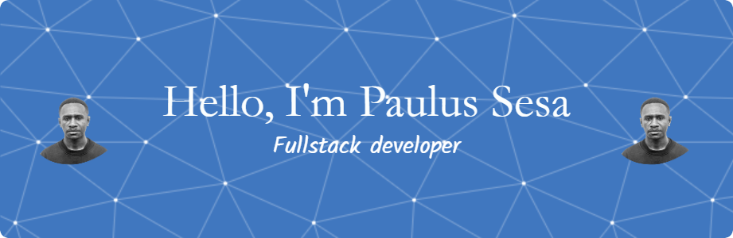

## 
 Hello Welcome👋
 

- 👀 I’m interested in web development
- 🌱 I’m currently learning HTML, CSS, JAVASCRIPT, PHP, SQL!
Menurut saya di era yang serba digital sekarang ini,
belajar koding, dapat membuka banyak sekali kesempatan atau
peluang untuk berkarir di dunia kerja.

## 💫 About me:
- 🔭 I am currently studying in the [SaCode community](www.sacode.web.id)
- 🌱 I'm currently learning HTML, CSS, JAVASCRIPT, PHP, SQL!
- 👯 I'm want to become a web developer
- 🤔In my opinion, in today's all-digital era, learning coding can open up a lot of        opportunities for a career in the world of work.
- 💬 Ask me about anything
- 📫 How to reach me: pauluspaul7700@gmail.com

## 🏛 Education:
- paradise university
- faculty of mathematics and natural   sciences
- Information Systems Student
- majoring in information systems

 ## 📚🙏 High school graduate
   Kabupaten Maybrat
   SMA Negeri 1 Ayamaru JL.Framu `2015-2018`

## 🌐Socials

## 💻Tech Stack
 
 
 	
<!--
**seanpaulsesa/seanpaulsesa** is a ✨ _special_ ✨ repository because its `README.md` (this file) appears on your GitHub profile.

Here are some ideas to get you started:

- 🔭 I’m currently working on ...
- 🌱 I’m currently learning ...
- 👯 I’m looking to collaborate on ...
- 🤔 I’m looking for help with ...
- 💬 Ask me about ...
- 📫 How to reach me: ...
- 😄 Pronouns: ...
- ⚡ Fun fact: ...
-->
